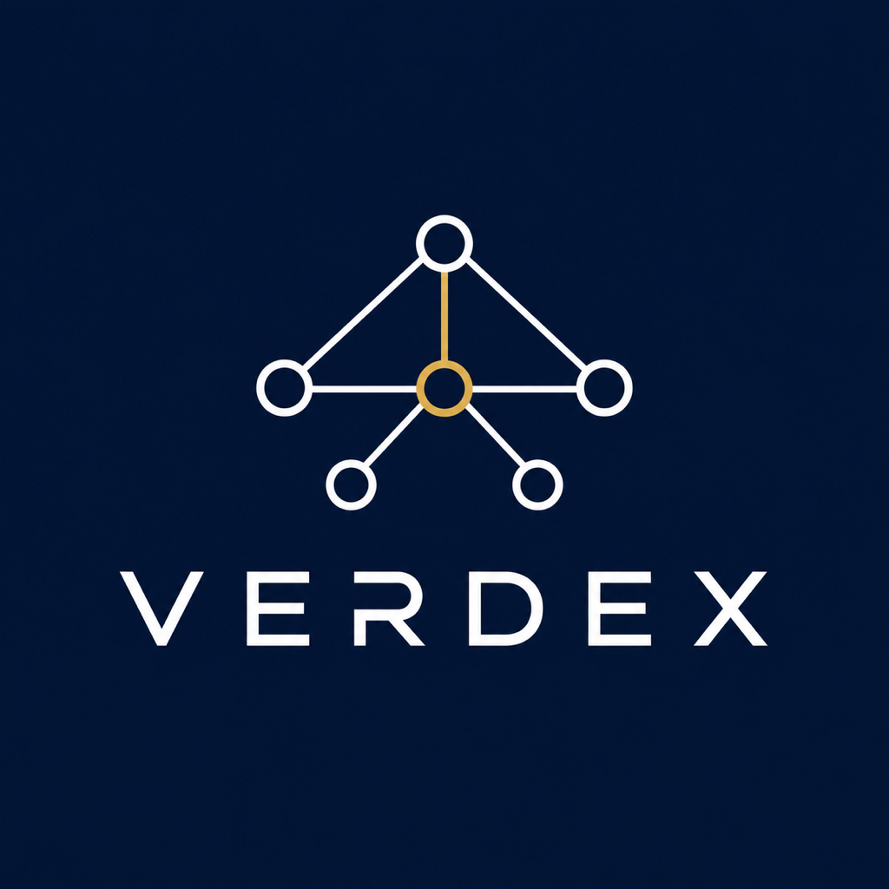
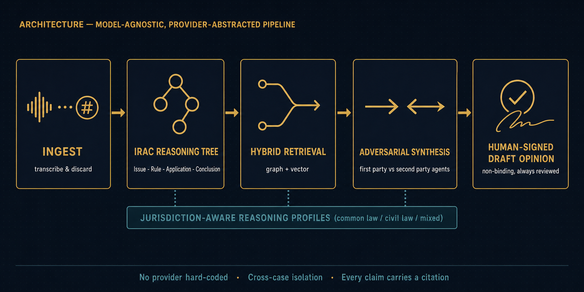

<div align="center">
  

  # Verdex

  **Jurisdiction-Aware Judicial Reasoning & Case Analysis Platform**

  [](LICENSE)
  [](go.work)
  [](package.json)
  [](#non-binding-disclaimer)

</div>

---

Verdex is a **model-agnostic legal reasoning engine** that turns raw case
materials — testimony, exhibits, statutes, precedent — into a structured,
citation-backed, adversarially-tested draft analysis. It does not decide
cases. It gives judges, advocates, and clerks a rigorously traced starting
point, then requires a qualified human to review, critique, and sign off
before anything leaves the system.

The engine is built around one idea: **legal reasoning is jurisdiction-
shaped, not jurisdiction-agnostic.** The same pipeline runs for a common-law
appeal, a civil-law statutory claim, or a mixed/Sharia-influenced family
matter — only the *weighting* of statute versus precedent, and the
procedural assumptions underneath it, change. One engine, reparameterized
per deployment.

---

## Non-Binding Disclaimer

> **All outputs produced by Verdex are draft analyses only. They are not
> legal advice, legal opinions, or judicial verdicts. Every output must be
> reviewed, critically evaluated, and signed off by a qualified human
> practitioner before any use. Verdex does not replace human judicial
> judgement.**

This is not a policy on top of the code — it **is** the code.
[`packages/guardrail`](packages/guardrail) blocks verdict and directive
language at the output layer, and [`packages/signoff`](packages/signoff)
makes every downstream use of a case's analysis conditional on a recorded
human sign-off. Neither can be configured away at deployment or user level.

---

## How it works

```
  INGEST                IRAC REASONING TREE          HYBRID RETRIEVAL          ADVERSARIAL SYNTHESIS         HUMAN-SIGNED
  transcribe & discard → Issue · Rule · Application  → graph + vector        → first party vs second party → DRAFT OPINION
                          · Conclusion                                         party agents, evidence-        non-binding,
                                                                                weighed                       always reviewed
```

1. **Ingest, then discard.** Audio, video, and scanned documents are
   transcribed or OCR'd, hashed for provenance, and the binary is deleted.
   Only extracted text — and the cryptographic proof of what it came from —
   is ever persisted.
2. **Assemble an IRAC tree.** Facts, issues, governing statutes, and
   precedent are structured into a validated Issue → Rule → Application →
   Conclusion graph, where every conclusion must trace to at least one fact
   and one rule.
3. **Retrieve, hybrid.** A fused graph-traversal-plus-vector-recall layer
   pulls the governing law and controlling precedent for each issue, built
   on demand rather than pre-computed wholesale.
4. **Argue both sides, then weigh.** Independent agents construct the
   strongest good-faith argument for each party, evidence is scored for
   reliability, and a synthesis agent resolves each issue — surfacing
   weak links and unsettled law rather than hiding them.
5. **Sign off, or it doesn't ship.** The draft analysis, its full reasoning
   trace, and every citation it rests on are reviewable in the case
   workspace. Nothing is usable downstream without an accountable human
   decision recorded against it.

<div align="center">
  
</div>

---

## Key properties

| Property | Guarantee |
|---|---|
| **Model-agnostic** | Every model call routes through [`packages/provider`](packages/provider)'s `LLMProvider` interface; no phase, agent, or package hardcodes a vendor. |
| **Jurisdiction-aware** | Reasoning weight (statute vs. precedent, procedural assumptions) is parameterized per legal family — common law, civil law, mixed, Sharia-influenced — via [`packages/reasoningprofile`](packages/reasoningprofile). |
| **Transcribe-and-discard** | Binary case materials are hashed, then deleted; only extracted text and chain-of-custody metadata persist ([`packages/provenance`](packages/provenance)). |
| **Non-binding by design** | Verdict/directive language is blocked in code, not just in prompts ([`packages/guardrail`](packages/guardrail)). |
| **Cross-case isolation** | Retrieval is case-scoped by construction; one case's facts cannot leak into another's reasoning ([`packages/knowledgeisolation`](packages/knowledgeisolation)). |
| **Full provenance** | Every claim traces to a source node; every source node carries a verifiable citation ([`packages/citation`](packages/citation)). |
| **Sovereign deployment** | A fully offline, zero-egress tier exists for the most sensitive courts ([`packages/airgapped`](packages/airgapped)). |
| **Auditable end to end** | Every sensitive action — data access, reasoning step, sign-off — writes to an immutable, hash-chained audit trail ([`packages/auditlog`](packages/auditlog)). |

---

## Platform capabilities

Verdex is a ~90-package monorepo built in eight parts. The table below is
the scannable summary; [`docs/architecture/overview.md`](docs/architecture/overview.md)
is the authoritative map, naming every package and linking to its own
design doc.

| Part | Capability |
|---|---|
| **1 — Foundation** | Multi-tenant config, observability, persistence, RBAC, and the provider-abstraction layer every later call routes through. |
| **2 — Ingest** | Transcribe-and-discard pipeline: speech-to-text, OCR, multilingual normalization (Arabic, Urdu, Tamil, English), PII handling, evidence classification. |
| **3 — IRAC schema** | The Issue/Rule/Fact/Application/Conclusion node model, plus statute, precedent, and legal-ontology representations that populate it. |
| **4 — Knowledge layer** | Graph + vector storage, tree assembly and integrity validation, hybrid retrieval, and citation-fidelity guarantees. |
| **5 — Reasoning & synthesis** | Issue-framing, first- and second-party argument agents, evidence weighing, law application, and the synthesis agent that produces the draft opinion — always behind the non-binding guardrail. |
| **6 — Case workspace** | Case lifecycle state machine, the judicial-facing web workspace (tree visualization, evidence review, opinion review), mandatory human sign-off, search, annotations, versioning, and reporting. |
| **7 — Security & compliance** | Encryption, key management, immutable audit trail, data residency, air-gapped deployment, access governance, privacy controls, and compliance-framework mapping. |
| **8 — Platform hardening** | External-system integration, bulk migration, corpus updating, localization, performance, scalability, reliability, infrastructure-as-code, and CI/CD hardening. |

See [`docs/README.md`](docs/README.md) for the full package-by-package index.

---

## Tech stack

| Layer | Stack |
|---|---|
| Backend services & packages | Go 1.25, npm-workspace-free Go workspace (`go.work`) across ~90 packages |
| Frontend | Next.js 14, React 18, TypeScript 6, Tailwind CSS 4 |
| Data | PostgreSQL + pgvector, graph store |
| CI/CD | GitHub Actions — lint, build, test, SCA/SAST scanning, documentation link checking, branch-and-commit policy enforcement |
| Deployment | Terraform-based IaC across cloud, on-premises, and fully air-gapped tiers |

---

## Monorepo layout

```
verdex/
├── apps/web/           # Judicial-facing case workspace (Next.js)
├── services/           # Backend microservices (Go)
├── packages/           # ~90 shared libraries — provider abstraction, IRAC
│                       #   engine, reasoning agents, security, ops
├── infra/              # Infrastructure as code (Terraform)
├── docs/               # Architecture, deployment, admin, and user docs
└── temp/               # Scratch space — not shipped in production builds
```

---

## Getting started

New to the codebase? Start with
[`docs/architecture/overview.md`](docs/architecture/overview.md), then:

| If you are... | Start with |
|---|---|
| Deploying a new tenant | [`docs/admin/setup-guide.md`](docs/admin/setup-guide.md), then the matching [`docs/deployment/`](docs/deployment/) guide |
| A judge or advocate using the platform | [`docs/user-guide/judges-advocates.md`](docs/user-guide/judges-advocates.md) |
| Operating the platform day to day | [`docs/operations/runbooks.md`](docs/operations/runbooks.md) |
| Integrating against Verdex's APIs | [`docs/api/reference.md`](docs/api/reference.md) |
| Reviewing security/compliance posture | [`docs/security-compliance/overview.md`](docs/security-compliance/overview.md) |

Common local commands (see [`Makefile`](Makefile) for the full list):

```bash
make lint         # golangci-lint across every Go module
make build        # build every Go module
make test         # test every Go module
make ts-lint      # ESLint + typecheck for apps/web
make ts-build     # next build for apps/web
```

---

## Documentation

[`docs/README.md`](docs/README.md) is the full documentation index — every
operator, admin, developer, and practitioner document in this repository,
including each package's own authoritative `doc/*.md`. Every relative link
in that tree is validated on every pull request by
[`packages/docsite`](packages/docsite)'s link checker, so it never goes
silently stale.

---

## Contributing

See [`CONTRIBUTING.md`](CONTRIBUTING.md) for full conventions. In short:

- One branch per unit of work — `phase-NNN-short-slug` for planned phases,
  `fix-short-slug` for small corrective work.
- Atomic commits, imperative mood, no squash merges — full history is
  required for audit.
- No phase may hardcode a model provider; no binary ingestion artifact may
  be persisted past extraction; every reasoning output must carry the
  non-binding label. These three rules are enforced in code and covered by
  tests, not left to review discipline alone.

---

## License

Apache 2.0 — see [`LICENSE`](LICENSE).
